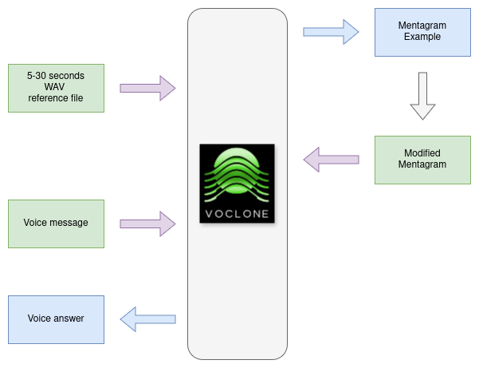

# VoCloneBot

A sophisticated AI-powered voice cloning and conversation system that enables natural, personalized interactions through voice synthesis and recognition.

## Overview

[VoCloneBot](https://t.me/voclone) facilitates meaningful conversations with AI using voice cloning technology. Whether conducting practice interviews or engaging in personal interactions, the system provides an authentic and emotionally resonant experience through personalized voice synthesis.

## Key Features

- **Simple Voice Cloning**: Instant voice adaptation through WAV file upload
- **Multi-language Support**: Automatic language detection and processing
- **Real-time Processing**: Fast response times through distributed architecture
- **Secure Communication**: Protected data transmission via ngrok tunneling
- **Personality Customization**: Personalize the AI's behavior and responses using user-defined Mentagram

## Technical Stack

- **Voice Synthesis**: [Custom TTS implementation](https://github.com/format37/tts/tree/main/TTS) with GPU acceleration
- **Speech Recognition**: [Google Cloud Speech-to-Text](https://github.com/format37/stt/tree/main/google/docker) API
- **API Gateway**: FastAPI for microservice communication
- **Proxy Service**: [ngrok](https://ngrok.com) for secure tunneling
- **Bot Framework**: [Custom Telegram server](https://github.com/format37/telegram_bot) for rapid response handling
- **Containerization**: Docker-based microservices architecture

## Installation

1. Clone the repository:
```bash
git clone https://github.com/format37/voclone.git
cd voclone
```

2. Configure the environment:
   - Set up `config.json` with required API keys and settings
   - Configure Telegram bot settings
   - Set up ngrok for TTS service access

3. Build and deploy services:
```bash
cd bot_server
chmod +x build.sh run.sh logs.sh
sh build_and_run.sh
```

## Configuration

1. Create and configure `config.json`:
```json
{
    "TOKEN": "your_telegram_token",
    "OPENAI_API_KEY": "your_openai_key",
    "LANGSMITH_API_KEY": "your_langsmith_key",
    "LANGSMITH_PROJECT": "voclonebot",
    "HISTORY_THRESHOLD": 4000,
    "TTS_API_URL": "http://localhost:5000"
}
```

2. Set up ngrok for TTS service:
```bash
sudo snap install ngrok
```

Configure ngrok service. Open ngrok.yaml:
```
ngrok config edit
```
Define:
```yaml
version: "3"
agent:
    authtoken: your_token
endpoints:
  - name: tts-tunnel
    url: your_url
    upstream:
      url: 5000
```
Install agent as system service:
https://ngrok.com/docs/agent/

Check status:
```
sudo systemctl status ngrok
```

## Usage

1. Start a conversation with the bot on Telegram
2. Upload a WAV file as voice reference
3. Send voice messages to interact with the AI
4. Use `/reset` to clear conversation history without affecting your personalization settings
5. Use `/mentagram` to customize the AI's personality:
   - The bot will send you a JSON file with your current configuration
   - Edit this file to customize how the AI behaves and responds
   - Upload the modified file back to the bot to apply your changes
   - To reset to default settings, upload a new mentagram.json file with default values



### Mentagram Configuration

The mentagram.json file allows you to customize:
- **system_prompt**: Define how the AI should behave and respond
- **chat_history**: Set up initial conversation context and memory

Example configuration:
```json
{
  "system_prompt": "Your name is Janet. You are a helpful AI assistant that specializes in technology and science topics.",
  "chat_history": [
    ["system", "Always provide examples in your explanations."],
    ["user", "How can you help me learn about AI?"],
    ["assistant", "I can explain AI concepts, recommend resources, and answer questions about machine learning, neural networks, and related topics."]
  ]
}
```

## Dependencies

- Python 3.9+
- FastAPI
- Google Cloud Speech-to-Text
- PyTelegramBotAPI
- LangChain
- FFmpeg
- Docker

## Related Projects

- [TTS Repository](https://github.com/format37/tts/tree/main/TTS)
- [Telegram Bot Framework](https://github.com/format37/telegram_bot)

## License

This project is licensed under the MIT License - see the LICENSE file for details.